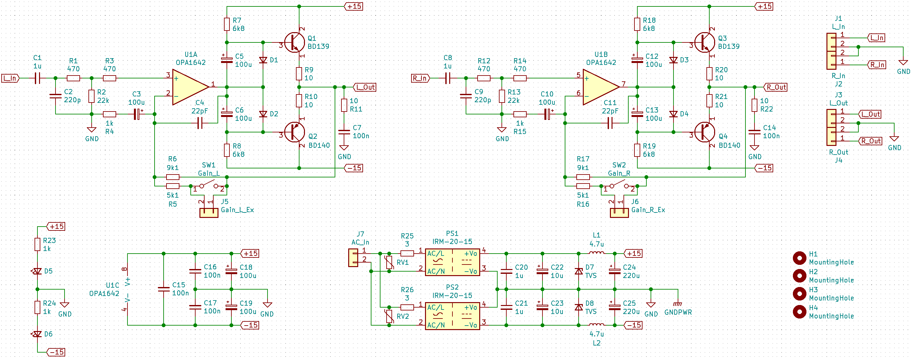
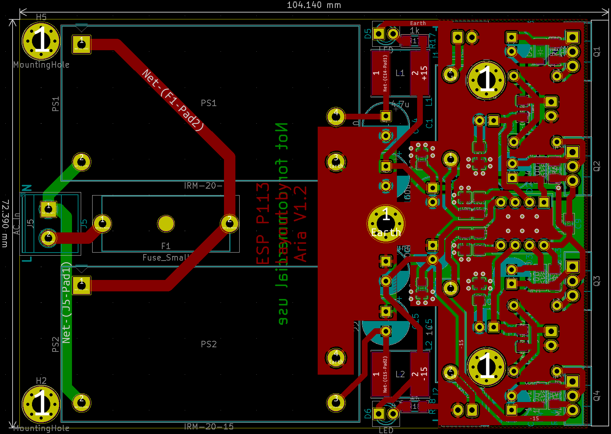
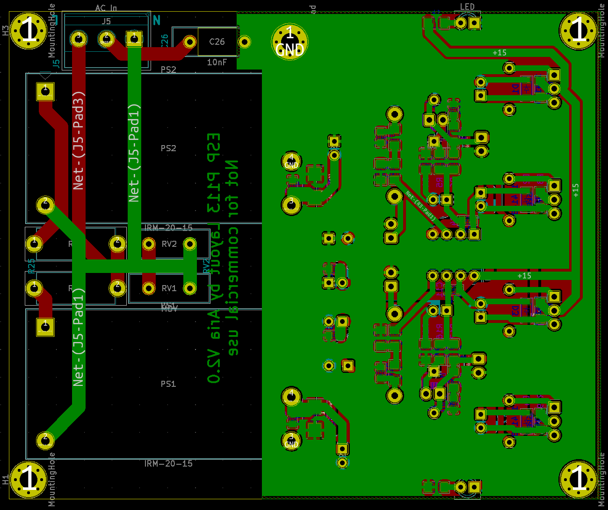
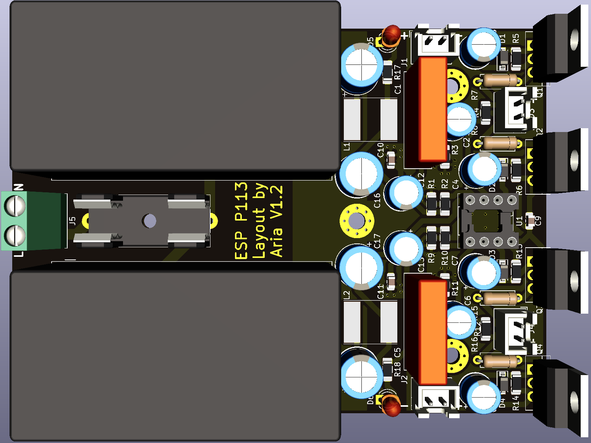
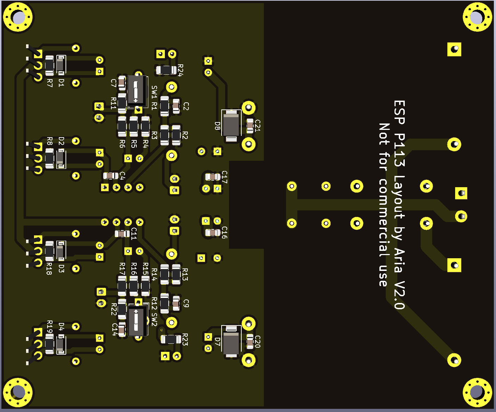
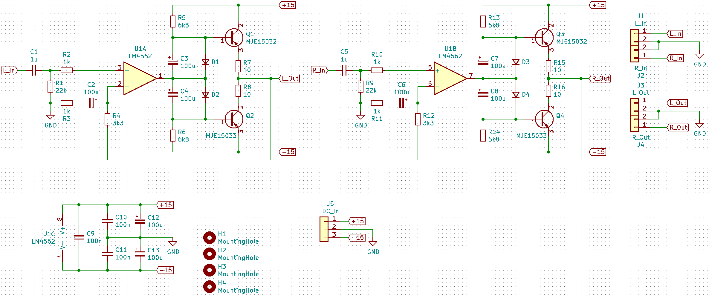
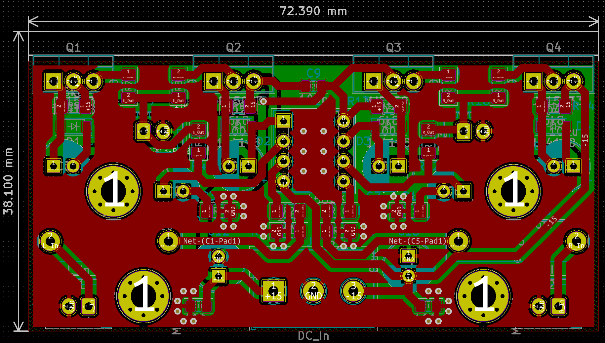
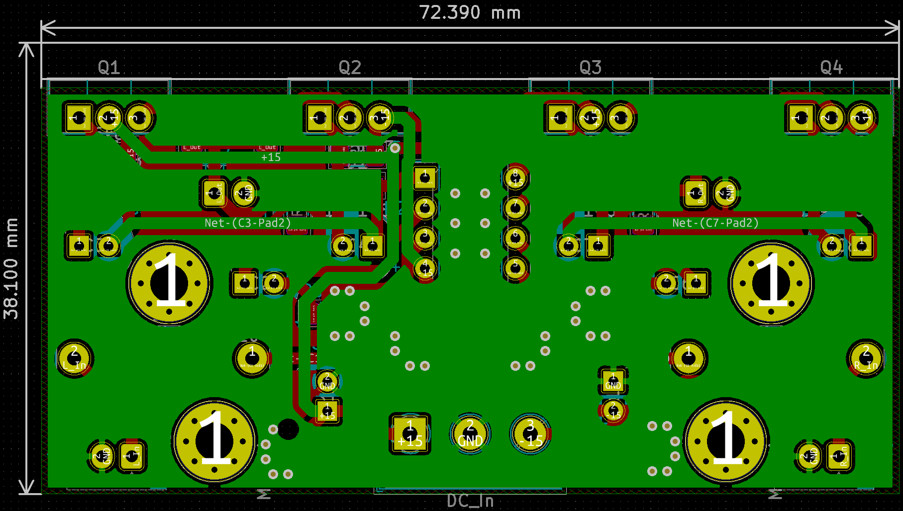
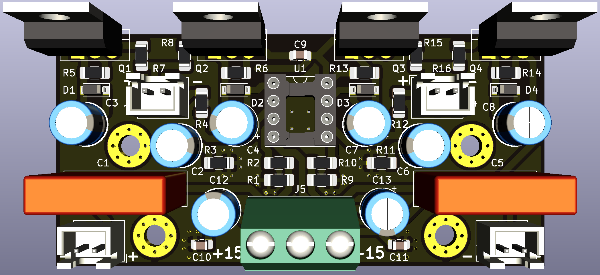
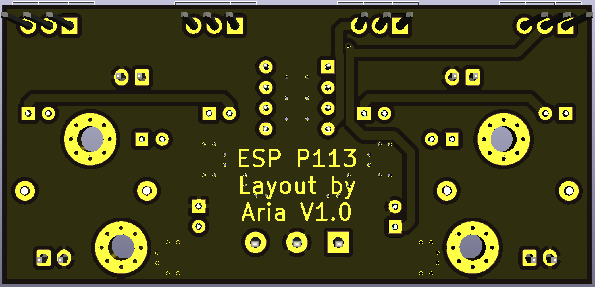

# ESP-P113
 Compact version of ESP's Project 113 Amplifier done with SMT resistors and ceramic caps. Two versions: one with on-board PSU and one without. PSU idea taken from https://theslowdiyer.wordpress.com/2019/09/10/project-files-filtered-irm-power-supplies-part-1/. PSU version is designed to go in sideways in this case (https://item.taobao.com/item.htm?id=54329725614). 

 ## Changelog
* 25/05/2021: Initial commit.
* 26/05/2021: Updated to V1.1. Added primary-side fuse, changed inductor to cheaper variant and rearranged components to make board even more compact. Updated BOM to match. Added extra M3 hole in middle of PCB and changed that hole to be the case grounding point instead.
* 27/05/2021: Updated to V1.2. Slightly changed position of transistors to allow for them to be mounted to an aluminium L-bracket and then to the case. 3mm power LEDs added. Changed output resistors to THT 0.5W versions. Added disclaimer on board.

 ## Integrated PSU Photos

 ## Amp Only Photos

