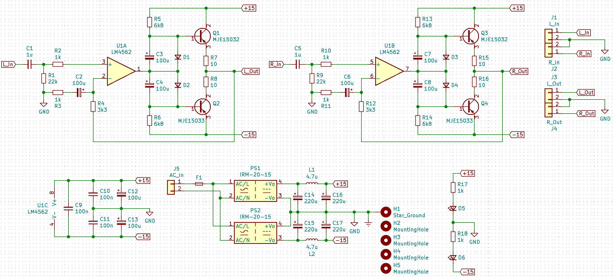
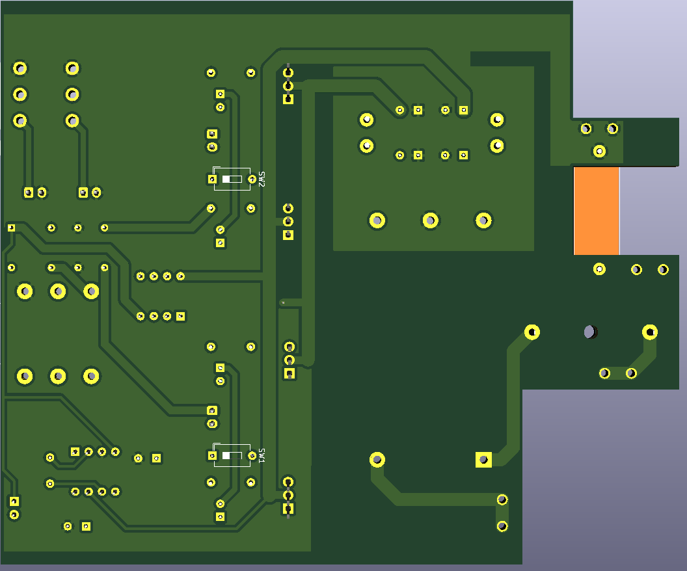

# ESP-P113
 Compact version of ESP's Project 113 Amplifier done with SMT resistors and ceramic caps. PSU idea taken from https://theslowdiyer.wordpress.com/2019/09/10/project-files-filtered-irm-power-supplies-part-1/.

