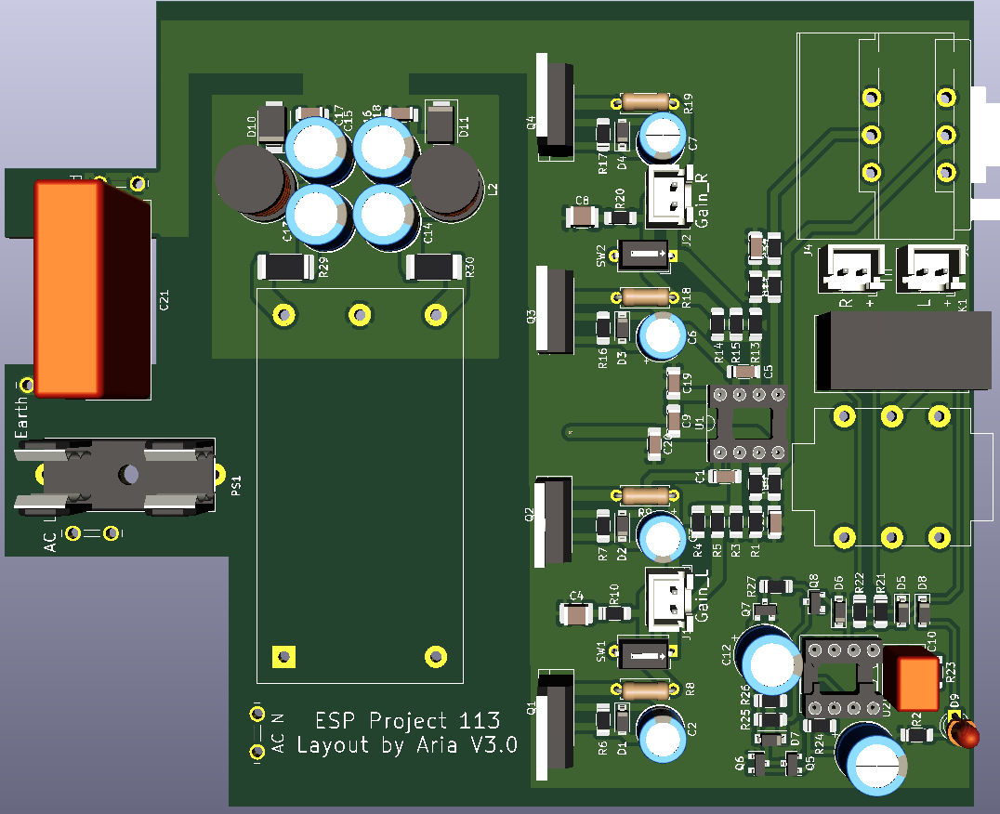

# ESP-P113
 Compact version of ESP's Project 113 Amplifier done with SMT resistors and ceramic caps. PSU idea taken from https://theslowdiyer.wordpress.com/2019/09/10/project-files-filtered-irm-power-supplies-part-1/.

 ## Changelog
* 25/05/2021: Initial commit.
* 26/05/2021: Updated to V1.1. Added primary-side fuse, changed inductor to cheaper variant and rearranged components to make board even more compact. Updated BOM to match. Added extra M3 hole in middle of PCB and changed that hole to be the case grounding point instead.

