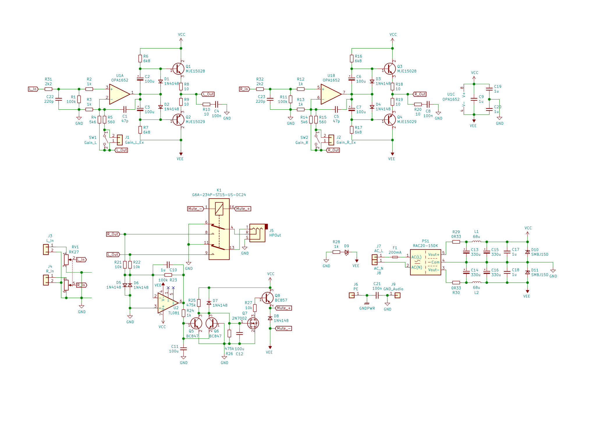
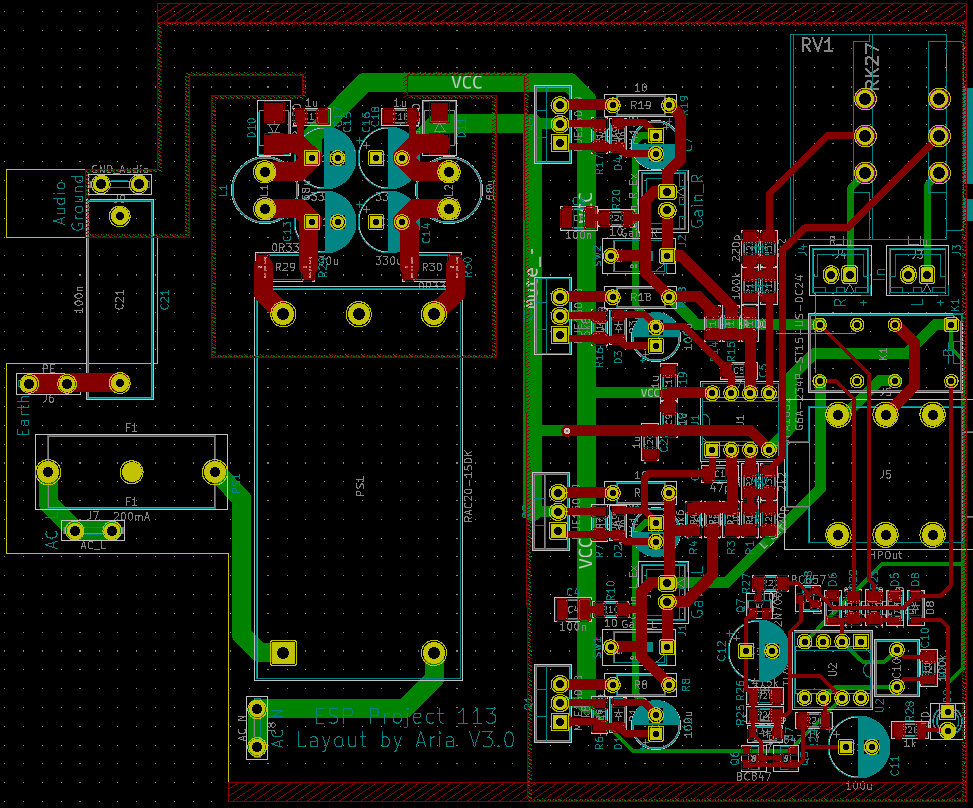
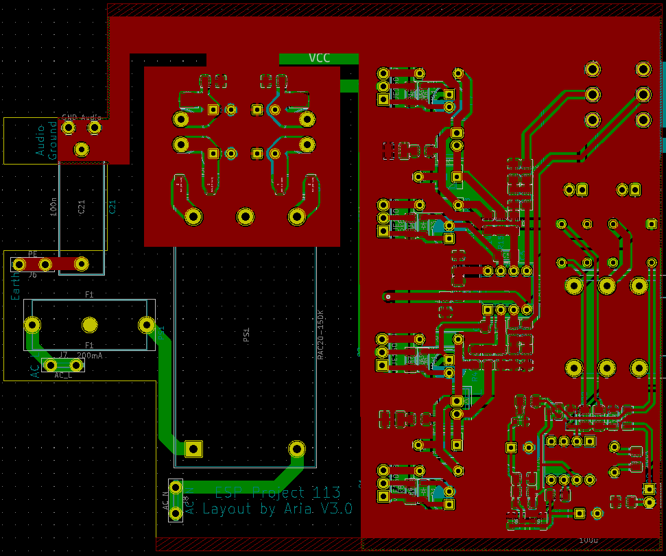
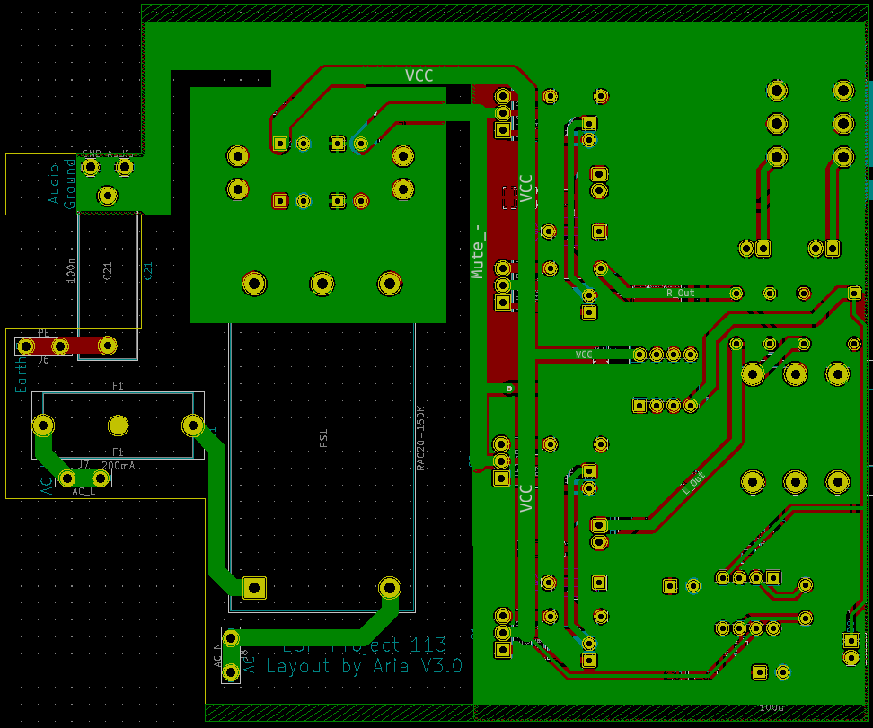

# ESP-P113
 Compact version of ESP's Project 113 Amplifier done with SMT resistors and ceramic caps. PSU idea taken from https://theslowdiyer.wordpress.com/2019/09/10/project-files-filtered-irm-power-supplies-part-1/. Designed to go in sideways in this case (https://item.taobao.com/item.htm?id=54329725614). 

 ## Changelog
 ### V1
* 25/05/2021: Initial commit.
* 26/05/2021: Updated to V1.1. Added primary-side fuse, changed inductor to cheaper variant and rearranged components to make board even more compact. Updated BOM to match. Added extra M3 hole in middle of PCB and changed that hole to be the case grounding point instead.
* 27/05/2021: Updated to V1.2. Slightly changed position of transistors to allow for them to be mounted to an aluminium L-bracket and then to the case. 3mm power LEDs added. Changed output resistors to THT 0.5W versions. Added disclaimer on board. Moved position of components in CLC filter for more optimal routing.
 ### V2
* 29/05/2021: Updated to V2.0. A 220p compensation cap between opamp output and inverting input helped tame ringing on square waves with a 600R load with 10nF in parallel. A standard zobel network has also been added. Fixed major error with transistors (used wrong symbols/wrong way round, oops!). Added varistor between each power supply input and 3R resistor in series into live input, changed capacitor layout in output and added TVS diode to protect electronics in case converter fails as per CUI PSK-20D datasheet. 3.15A fuses into each live input will also be added off-board in the final design. Added gain switchs to toggle gain resistance between 3k3 and 9k1 by switching 5k1 resistor in and out of parallel (actual resistance with both resistors in parallel is around 3k27, close enough), with option to choose between on-board DIP switches and off-board headers to use another switch. Output transistors changed to BD139/140. New layout, slightly larger but should still fit in planned case. Many thanks to user AnalogSteph on ASR for the help on the majority of the changes.
 ### V3
* 04/06/2021: Updated to V3.0. New layout with (hopefully) accurate measurements as drawings of case to be used have been received. Changed PSU to RAC20-15DK to save space and removed varistor. 1A fuse will be used instead of 3.15A. Output BJTs changed to MJE15028/29s as they offer slightly better simulated distortion. The gain resistors have been changed to 620R/6k2 and R2 has been changed to 1k1 to allow for gain values of 1.51 and 6.64. The CLCLC PSU filter has been simulated in LTspice and values were chosen that would not cause ringing. The DC protection and muting circuit from AMB has been added to protect the headphone out. On-board Y2 capacitor has been added.

 ## Photos

